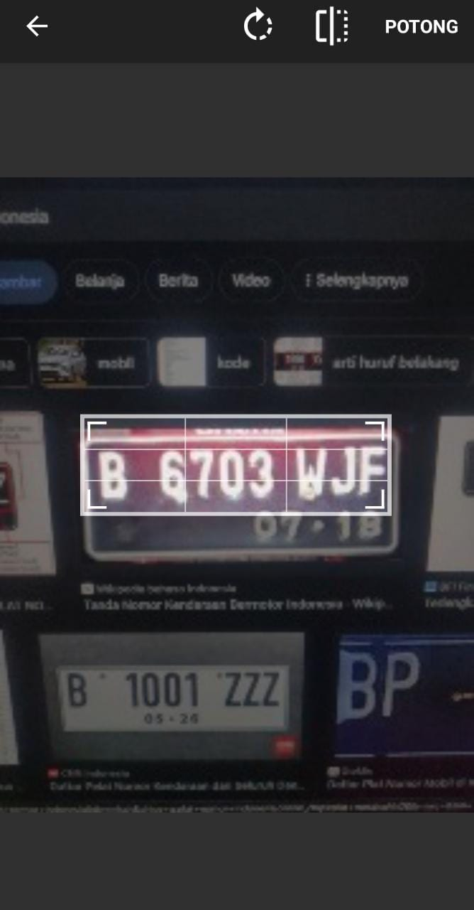
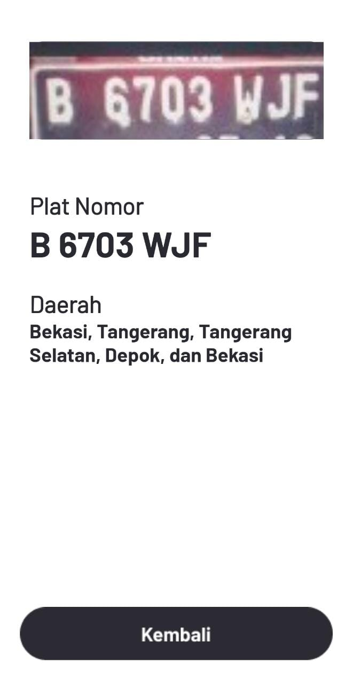

# Revelipt-Licence-Plate-Recognizer
## Penjelasan Umum
Revelipt (Recognition of Vehicle Licence Plate) merupakan aplikasi android yang berguna untuk mengenali plat nomor kendaraan Indonesia dan menentukan dari daerah mana plat nomor tersebut. Konsep Revelipt adalah dengan melakukan rekognisi teks yang ada pada gambar (Image to Text) plat nomor kemudian mengolah teks tersebut menjadi daerah asal plat nomor dan menampilkannya pada aplikasi. Revelipt sendiri menggunakan algoritma OCR (Optical Character Recognition) dengan menggunakan bantuan API Google Vision dari google. Sealin itu, Revelipt juga menggunakan ImageCropper dari ArthurHub untuk melakukan crop gambar agar rekognisi lebih mudah dilakukan.

## Instalasi
1. Clone github ini atau download seluruh file pada github ini.
2. Buka project pada android studio
3. Sync gradle untuk memastikan gradle sudah sesuai dengan project.
4. Build apk agar aplikasi dapat dijalankan di android.
5. Install apk di android dan aplikasi siap digunakan.

## Tampilan
Setelah aplikasi dibuka, tampilan yang pertama akan muncul adalah tampilan welcome message yang menjelaskan secara singkat bagaiamana cara kerja dari Aplikasi Revelipt ini.

Selanjutnya, setelah pengguna menekan tombol Mulai, pengguna akan diarahkan ke main menu, dimana pada menu ini, pengguna dapat memilih sumber gambar plat nomor yang akan di rekognisi, bisa melalui kamera dengan tangkapan secara langsung, atau menggunakan galeri dimana pengguna memilih gambar yang tersimpan di galeri.

Setelah selesai mengambil gambar dari kamera ataupun dari galeri, pengguna akan diminta untuk melakukan crop dari gambar yang sudah diambil dan diambil hanya bagian yang terdapat plat nomor di dalamnya.

Setelah menentukan bagian dari gambar yang akan direkognisi, aplikasi akan berpindah ke tampilan hasil rekognisi, dimana pada tampilan ini terdapat gambar plat nomor, teks plat nomor, daerah pemilik plat nomor dan tombol untuk kembali ke main menu.

